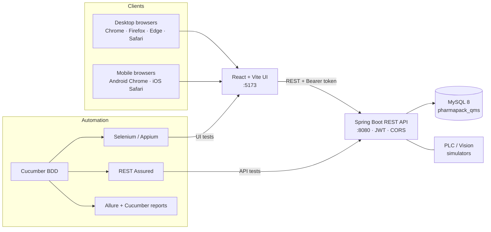
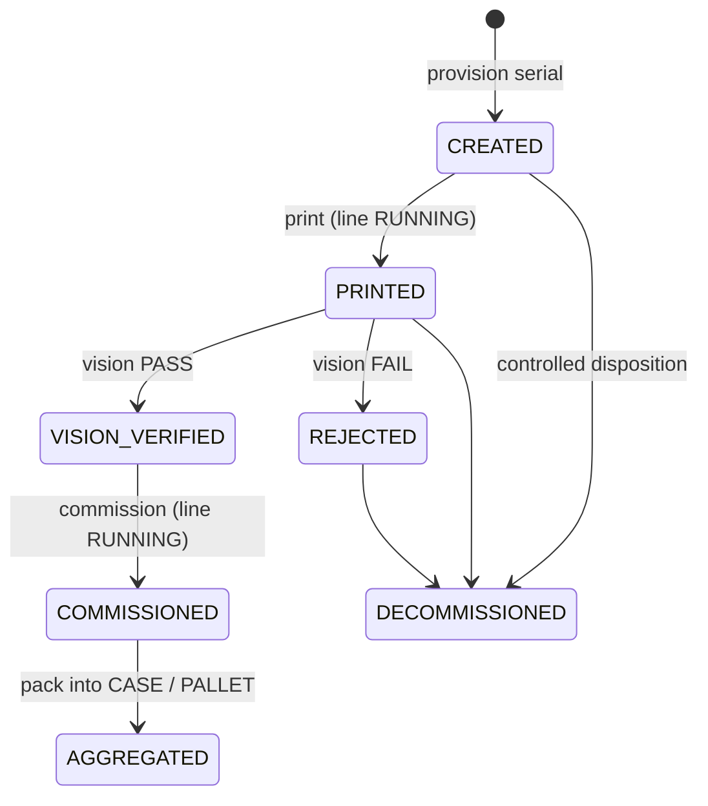

# RbcTcsWorld PharmaPack QMS — Serialization & Line Control

A full-stack **pharmaceutical packaging Quality Management System** with a simulated **L3 serialization line**
(PLC, printer, vision camera, aggregation), backed by a **cross-platform test-automation framework**
(Cucumber BDD · REST Assured · Selenium · Appium · Allure).

> Portfolio / training project by **RB Chowdhury** — combines hands-on GMP packaging-line experience with QA automation.
> It is **not** a validated GxP system (see [Disclaimer](#disclaimer)).

       [](https://github.com/rbchy/RbcTcsWorld_PharmaPackQMS_Serialization/actions/workflows/ci.yml) [](https://rbchy.github.io/RbcTcsWorld_PharmaPackQMS_Serialization/)

---

## Contents
- [What it does](#what-it-does)
- [Architecture](#architecture)
- [Serialization workflow (GMP rules)](#serialization-workflow-gmp-rules)
- [Tech stack](#tech-stack)
- [Project structure](#project-structure)
- [Getting started](#getting-started)
- [Desktop edition (Windows / macOS / Linux)](#desktop-edition-windows--macos--linux--no-install-needed)
- [Test automation](#test-automation)
- [Cross-platform UI testing](#cross-platform-ui-testing)
- [Reports](#reports)
- [Defects found by automation](#defects-found-by-automation)
- [Roadmap](#roadmap)
- [Disclaimer](#disclaimer)

---

## What it does

| Area | Capabilities |
|---|---|
| **Master data** | Products, batches, materials, equipment, packaging lines |
| **Production** | Production runs and shift entries |
| **Quality** | AQL sampling inspections, batch reconciliation, QA review, deviations, CAPA |
| **Compliance** | Audit trail for every create/update, electronic signatures (21 CFR Part 11 concepts), JWT login with roles (Admin, QA, Supervisor, Operator, Inspector) |
| **Serialization (Phase 4)** | Serial provisioning, printing, vision (DataMatrix / lot / expiry) verification, commissioning, controlled decommissioning with reason codes, UNIT → CASE → PALLET aggregation, full event history |
| **Line control** | PLC simulator (START / STOP / FAULT / E-STOP) with printer, vision, scanner and reject-station states |
| **Operator HMI** | React UI with one tab per module and a packaging-line / serialization screen |

## Architecture



## Serialization workflow (GMP rules)



Rules the backend enforces, each backed by an automated test:

1. Only a **PRINTED** serial can be vision-verified. The camera can only inspect a code that has been printed.
2. Only a **VISION_VERIFIED** serial (vision PASS) can be **commissioned**.
3. Print, vision and commission are **line operations**: they are refused with `409 Conflict` unless the PLC is `RUNNING`.
4. Only **COMMISSIONED** serials can be aggregated, and only under a higher level (UNIT < CASE < PALLET) of the same batch.
5. Every step writes a serialization event, which forms the audit trail (`GET /api/serialization/{serial}/events`).

## Tech stack

| Layer | Technology |
|---|---|
| Backend | Java 21, Spring Boot 3.5 (Web, Data JPA, Security, Validation), JWT (jjwt), Lombok |
| Database | MySQL 8 (SQL scripts in `database/`) |
| Frontend | React 19, TypeScript, Vite |
| API tests | Cucumber 7, REST Assured 5, JUnit 5 Platform |
| UI tests | Selenium 4 (Selenium Manager), Appium (UiAutomator2 / XCUITest), Selenium Grid, BrowserStack |
| Reporting | Allure (with request/response attachments and screenshots), Cucumber HTML / JSON / JUnit XML / timeline |
| Build | Maven |

## Project structure

```
RbcTcsWorld_PharmaPackQMS_Serialization/
├── backend/src/main/java/com/pharmapack/qms/
│   ├── auth/            JWT login, roles, security & CORS config
│   ├── serialization/   serialization workflow, vision results, events, aggregation
│   ├── line/            PLC / device simulator
│   ├── batch/ product/ master/ production/ aql/ reconciliation/
│   ├── qa/ deviation/ capa/ audit/ esignature/
│   └── common/          global exception handler
├── frontend/src/        React UI (main.tsx, Login.tsx, validation.ts)
├── database/            schema, seed data, phase migrations, verify.sql
├── automation/          test-automation framework (own pom.xml)
│   └── src/test/
│       ├── java/com/pharmapack/automation/
│       │   ├── steps/       ApiSteps, SerializationLineSteps, UiSteps, ReportHooks
│       │   ├── pages/       Page Objects (Login, AppShell, Serialization)
│       │   ├── ui/          DriverFactory, DriverManager, UiConfig
│       │   └── support/     ApiAuth (shared JWT login)
│       └── resources/features/   *.feature (API) and ui/*.feature (@ui)
├── docs/                ERD, workflow, form design, industry comparison
├── pom.xml              backend build
└── RUNBOOK.md           step-by-step local setup
```

## Getting started

### Prerequisites
JDK 21, Maven 3.9+, MySQL 8, Node.js 20+ (and npm).

### 1. Database
```bash
mysql -u root -p < database/schema.sql
mysql -u root -p < database/seed.sql
mysql -u root -p < database/create_app_user.sql
mysql -u root -p < database/phase2-migration.sql
mysql -u root -p < database/phase3-password-update.sql
mysql -u root -p < database/phase4-systech-serialization.sql
```

### 2. Backend (terminal 1)
```bash
mvn spring-boot:run
```
The API runs on `http://localhost:8080/api`. You can override settings with environment variables:
`DB_URL`, `DB_USERNAME`, `DB_PASSWORD`, `JWT_SECRET`, `SERVER_PORT`, `CORS_ORIGIN_PATTERNS`.

### 3. Frontend (terminal 2)
```bash
cd frontend
npm install
npm run dev
```
Open `http://localhost:5173`. The dev server also listens on your LAN IP, so phones and other PCs can open it too.

### Demo users (training data only)

| Username | Password | Role |
|---|---|---|
| admin | admin123 | Admin |
| qa_user | qa123 | QA |
| supervisor | super123 | Supervisor |
| operator | operator123 | Operator |
| inspector | inspect123 | Inspector |

## Desktop edition (Windows / macOS / Linux — no install needed)

A standalone build of the whole app: React UI, Spring Boot API, an **embedded H2 database** with the demo data, and its own Java runtime.
No MySQL, Java or Node.js is needed on the target computer.

**Get it:** open the **Actions** tab, run **Package desktop apps**, then download the artifact for your OS.
Pushing a tag such as `git tag v1.0.0 && git push origin v1.0.0` also attaches the files to a GitHub **Release**.

| OS | Portable (unzip and run) | Installer |
|---|---|---|
| Windows | `PharmaPackQMS-1.0.0-windows-portable.zip`, then run `PharmaPackQMS\PharmaPackQMS.exe` | `PharmaPackQMS-1.0.0.msi` |
| macOS | `PharmaPackQMS-1.0.0-macos-portable.zip`, then run `PharmaPackQMS.app` | `PharmaPackQMS-1.0.0.dmg` |
| Linux | `PharmaPackQMS-1.0.0-linux-portable.tar.gz`, then run `PharmaPackQMS/bin/PharmaPackQMS` | `pharmapackqms_1.0.0_amd64.deb` |

**What happens when it runs:**

- The browser opens `http://localhost:8080` automatically. Log in as `admin` / `admin123`.
- A tray icon offers **Open** and **Quit**. On Windows, a console window shows the log; closing it stops the app.
- **Phones, tablets and other PCs** on the same Wi-Fi can use the "Other devices" address printed at startup, for example `http://192.168.1.20:8080`. Allow the firewall prompt on first run.
- Data is kept in `~/.pharmapack-qms/`. Delete that folder to reset to the demo data.
- The builds are unsigned demo builds. On macOS, right-click the app and choose **Open** the first time. On Windows, click **More info → Run anyway** in SmartScreen.

**Build and run locally (Java 21 + Node 20):**

```bash
cd frontend && npm install && npx vite build && cd ..
mvn -DskipTests package
java -Dspring.profiles.active=desktop -jar target/pharmapack-qms-0.2.0-SNAPSHOT.jar
```

The regular MySQL setup below is unchanged. The desktop edition only switches on with the `desktop` profile.

## Test automation

All commands below run from `automation/`, with the backend running (plus the frontend for UI tests).

| Run | Command |
|---|---|
| API suite (default) | `mvn clean test -DbaseUrl=http://localhost:8080/api` |
| UI suite, Chrome | `mvn clean test -Pui -Dplatform=chrome` |
| Everything (API + UI) | `mvn clean test -Pall -Dplatform=chrome` |
| Only GMP negative tests | `mvn clean test -Dcucumber.filter.tags="@gmp and @negative"` |
| Headless (CI) | add `-Dheadless=true` |

**Current result: 46 / 46 passing.** That is 39 Cucumber API scenarios, 4 Cucumber UI scenarios and 3 JUnit smoke tests.

**Coverage highlights**
- Every QMS module: products, batches, production, AQL, reconciliation, QA review, deviations, CAPA, audit trail, e-signatures, auth.
- End-to-end serialization: provision → print → vision → commission → aggregate, including audit-trail verification.
- GMP negative tests: wrong DataMatrix, vision on an unprinted serial, commissioning without vision, print or commission on a stopped line, invalid aggregation.
- UI: login (valid and invalid), line START/STOP on the HMI, serial generation and print, and the Commission button staying disabled before vision.

**Framework design**
- `ApiAuth` logs in once per run and reuses the JWT token.
- `{{variables}}` capture values between steps, for example `{{caseSerial}}`.
- `@After("@stops-line")` restarts the line so scenarios stay independent of each other.
- The UI uses Page Objects with `data-testid` locators and explicit waits (no sleeps).
- `ThreadLocal` WebDrivers make the suite ready for parallel runs.

## Cross-platform UI testing

The same `@ui` scenarios run on every target. Choose one with `-Dplatform` (and optionally `-Dexecution`):

| Target | Command | One-time setup |
|---|---|---|
| Chrome / Firefox / Edge | `-Pui -Dplatform=chrome` (or `firefox`, `edge`) | none — Selenium Manager downloads the driver |
| Safari (macOS) | `-Pui -Dplatform=safari` | `sudo safaridriver --enable` and Safari ▸ Develop ▸ Allow Remote Automation |
| Windows (Edge) | on a Windows PC: `-Pui -Dplatform=windows -DuiBaseUrl=http://<mac-ip>:5173 -DbaseUrl=http://<mac-ip>:8080/api` | JDK 21, Maven, Edge |
| Android (Chrome) | `-Pui -Dplatform=android` | Android emulator; `npm i -g appium`; `appium driver install uiautomator2`; `appium --allow-insecure chromedriver_autodownload` |
| iOS (Safari) | `-Pui -Dplatform=ios -Ddevice="iPhone 16"` | Xcode simulator; `appium driver install xcuitest`; `appium` |
| Selenium Grid | `-Dexecution=grid -Dgrid.url=http://<grid>:4444` | a running Grid |
| BrowserStack (real devices) | `-Dexecution=browserstack -Dplatform=ios` (any platform) | `BROWSERSTACK_USERNAME`, `BROWSERSTACK_ACCESS_KEY`, BrowserStack Local running |

More options: `-Ddevice`, `-Dos.version`, `-Dudid` (real devices), `-Dappium.url`, `-Dui.timeout`.
See [`automation/README.md`](automation/README.md) for full details.

## Reports

| Report | How to open |
|---|---|
| **Allure** (dashboard, severity, trends, API request/response attachments, UI screenshots, environment, failure categories) | `mvn allure:serve` |
| Cucumber HTML | `automation/target/cucumber-reports/cucumber.html` |
| Cucumber JSON / JUnit XML (for CI) | `automation/target/cucumber-reports/` |
| Execution timeline | `automation/target/cucumber-reports/timeline/index.html` |

Allure failure categories separate **product defects** (5xx errors, broken GMP rules) from **environment issues** (backend down, 401 errors) and **test-code problems**.

## Defects found by automation

| ID | Severity | Defect | Status |
|---|---|---|---|
| DEF-01 | **Critical (GMP)** | A serial could be commissioned from `PRINTED` without a vision PASS | Fixed, covered by API and UI tests |
| DEF-02 | High | `/serialization/{sn}/vision` and `/events` returned 500 (lazy-loading outside the session) | Fixed, `@EntityGraph` |
| DEF-03 | Medium | Vision verification accepted a serial that had never been printed | Fixed, returns 400 |
| DEF-04 | Medium | Print and commission were allowed while the line was STOPPED or FAULTED | Fixed, returns 409 |
| DEF-05 | High | Pressing **START LINE** crashed the UI (blank page), because the state update dropped `devices` | Fixed, covered by a UI test |
| DEF-06 | Low | The serialized-units table does not refresh after generating serials unless a batch is already selected | Open |

In each case the test was written first and failed (red); the fix was then verified (green).

## Roadmap
- [x] GitHub Actions CI: MySQL service, backend, headless UI, Allure published to GitHub Pages
- [ ] Per-scenario test data (a fresh batch per run) for fully isolated and parallel runs
- [ ] JDBC-level verification of `serialized_units`, `serialization_events`, `vision_results`
- [ ] More UI coverage: vision simulator, decommission, aggregation screens
- [ ] Android and iOS runs in CI via BrowserStack
- [ ] Fix DEF-06

## Disclaimer
This is a **portfolio / training simulation**. It is inspired by publicly documented industry concepts (DSCSA / EU-FMD serialization, L3 line management, aggregation). It is **not** a copy of any vendor's proprietary software, and it is **not** a validated GxP production system.

A real GMP deployment would require:
- formal computer-system validation (IQ/OQ/PQ)
- change control and data-integrity controls
- security review, backup and recovery
- site SOP alignment and market-specific regulatory configuration

All credentials and secrets in this repository are demo values.

## Author
**RB Chowdhury** — QA Automation Engineer · Pharmaceutical Packaging Production (GMP)
GitHub: [@rbchy](https://github.com/rbchy) · Portfolio: [rbc6543.wixsite.com/rbc-portfolio](https://rbc6543.wixsite.com/rbc-portfolio)
