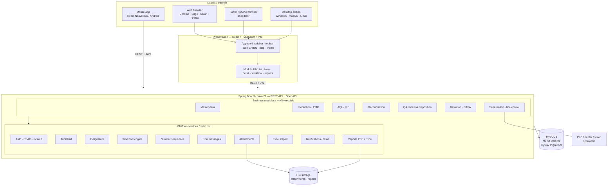
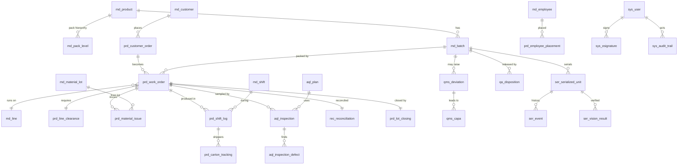
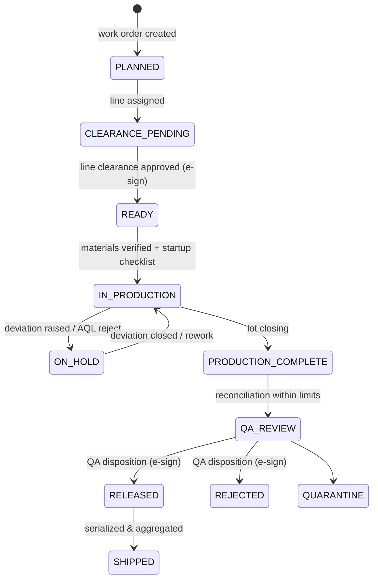
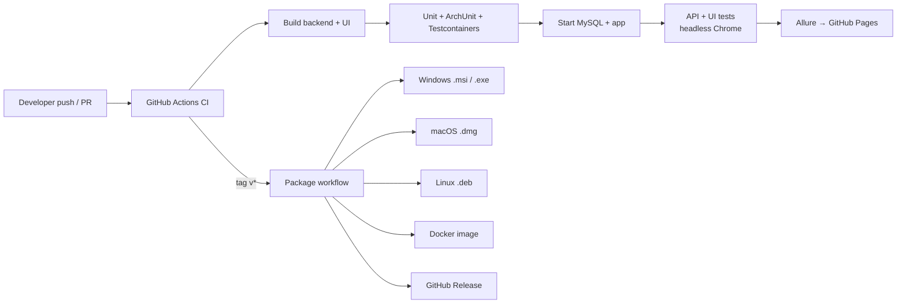

# RbcTcsWorld PharmaPack Suite
### Unified Pharmaceutical Packaging Platform — PMS · QMS · L3 Serialization
### একীভূত ফার্মাসিউটিক্যাল প্যাকেজিং প্ল্যাটফর্ম — উৎপাদন · মান ব্যবস্থাপনা · সিরিয়ালাইজেশন

> **Design & architecture blueprint** that merges three existing projects into **one enterprise product**:
> **তিনটি বিদ্যমান project মিলিয়ে একটি enterprise product বানানোর design ও architecture নকশা:**
>
> | Source project | What it brings | যা যোগ করে |
> |---|---|---|
> | `RbcTcsWorld_PharmaPackQMS_Serialization` | Spring Boot + React web app, JWT/RBAC, QMS modules, L3 serialization and line simulator, Cucumber/Selenium/Appium automation, Allure, GitHub Actions, desktop builds | মূল web ভিত্তি, serialization, automation আর CI |
> | `RbcTcsWorld_PharmaPackQMS` | Line clearance, material verification, packaging orders, account lockout, Flyway, **URS / Risk / RTM / IQ-OQ-PQ** validation docs, Jenkins, iOS app (React Native) | Validation নথি, line clearance, mobile app |
> | `PPES` (Pharmaceutical PMC — Packaging Management) | Work-order packing spec, carton tracking, shift production log, lot closing, batch yield calculator, IPC, pallet/shipper label, shift handover, in-process waste, **Excel import/export**, bilingual help | Shop-floor উৎপাদন (execution) module আর Excel |
>
> Portfolio / training system — **not validated for GMP production use** (see [Disclaimer](#18-disclaimer--দায়মুক্তি)).
> Portfolio বা প্রশিক্ষণের জন্য তৈরি — আসল GMP উৎপাদনে ব্যবহারের জন্য validated নয়।

---

## Contents / সূচিপত্র
1. [Vision & goals / লক্ষ্য](#1-vision--goals--লক্ষ্য)
2. [Module map / Module-এর মানচিত্র](#2-module-map--module-এর-মানচিত্র)
3. [Where each feature comes from / কোন feature কোথা থেকে](#3-where-each-feature-comes-from--কোন-feature-কোথা-থেকে)
4. [Architecture / স্থাপত্য](#4-architecture--স্থাপত্য)
5. [Platform (shared) services / সাধারণ সেবা](#5-platform-shared-services--সাধারণ-সেবা)
6. [Data model / Database নকশা](#6-data-model--database-নকশা)
7. [Core workflows / মূল কর্মপ্রবাহ](#7-core-workflows--মূল-কর্মপ্রবাহ)
8. [UI / UX design / ব্যবহারকারী ইন্টারফেস](#8-ui--ux-design--ব্যবহারকারী-ইন্টারফেস)
9. [Module "Definition of Done" / প্রতিটা module-এর মানদণ্ড](#9-module-definition-of-done--প্রতিটা-module-এর-মানদণ্ড)
10. [Security & compliance / নিরাপত্তা ও নিয়ম](#10-security--compliance--নিরাপত্তা-ও-নিয়ম)
11. [Multilingual & help / বহুভাষা ও সহায়তা](#11-multilingual--help--বহুভাষা-ও-সহায়তা)
12. [Reports / রিপোর্ট](#12-reports--রিপোর্ট)
13. [Quality engineering (QA / SDET) / টেস্টিং কৌশল](#13-quality-engineering-qa--sdet--টেস্টিং-কৌশল)
14. [Validation package (CSV/CSA) / Validation নথি](#14-validation-package-csvcsa--validation-নথি)
15. [Delivery: CI/CD & deployment / চালু করার পদ্ধতি](#15-delivery-cicd--deployment--চালু-করার-পদ্ধতি)
16. [Repository structure / ফাইল কাঠামো](#16-repository-structure--ফাইল-কাঠামো)
17. [Roadmap & migration plan / ধাপে ধাপে পরিকল্পনা](#17-roadmap--migration-plan--ধাপে-ধাপে-পরিকল্পনা)
18. [Disclaimer / দায়মুক্তি](#18-disclaimer--দায়মুক্তি)

---

## 1. Vision & goals / লক্ষ্য

**English.** One integrated platform follows a packaging batch from **work order to release to serialized shipment**:

`Work Order → Line Clearance → Material Issue & Verification → Production (shifts, cartons, IPC) → AQL → Reconciliation & Lot Closing → Deviation / CAPA → QA Disposition (e-signed) → Serialization & Aggregation → Shipment`

It must be:

- **Complete.** Every screen in the module map has database, API, form, validation, audit, e-signature where needed, report, help (EN/BN) and automated tests.
- **Compliant by design.** It follows 21 CFR Part 11 / EU Annex 11 *concepts*: audit trail, e-signatures, access control and ALCOA+ data integrity.
- **Usable.** Operators on tablets, supervisors on desktop and QA on any device. It is bilingual, task-driven and batch-centric.
- **Portable.** It runs as a web server, a one-click desktop app (Windows/macOS/Linux), a Docker container, or on a phone browser. A mobile app is also available.
- **Provable.** The CI pipeline proves every requirement through an RTM, and each release publishes Allure reports.

**বাংলা.** একটা প্ল্যাটফর্মেই একটা packaging batch-এর পুরো যাত্রা দেখা যাবে: **Work Order থেকে QA Release হয়ে serialized shipment পর্যন্ত**। লক্ষ্যগুলো হলো:

- **সম্পূর্ণ:** প্রতিটা screen-এর database, API, form, validation, audit, e-signature, report, দ্বিভাষিক help আর automated test থাকবে।
- **নিয়ম মেনে তৈরি:** 21 CFR Part 11 আর Annex 11-এর ধারণা (audit trail, e-signature, access control, ALCOA+) শুরু থেকেই থাকবে।
- **সহজে ব্যবহারযোগ্য:** Operator tablet-এ, supervisor desktop-এ, আর QA যেকোনো device-এ কাজ করতে পারবে। ইন্টারফেস বাংলা ও ইংরেজি দুই ভাষায়, আর batch-কেন্দ্রিক।
- **সব জায়গায় চলে:** Web, এক-click desktop app, Docker, আর phone browser বা mobile app-এ।
- **প্রমাণযোগ্য:** প্রতিটা requirement-এর test আর report CI থেকে প্রমাণসহ পাওয়া যাবে।

---

## 2. Module map / Module-এর মানচিত্র

Legend: 🟢 exists (extend) · 🟡 partly exists · 🔵 new
চিহ্ন: 🟢 আছে (বড় করতে হবে) · 🟡 আংশিক আছে · 🔵 নতুন

```
RbcTcsWorld PHARMAPACK SUITE  (MIS / PMS / QMS / SERIALIZATION)
│
├── 🏠 Dashboard ............................... 🟡  My Tasks, KPIs, batch status board, alerts
│
├── 🗂 MASTER DATA
│   ├── 📦 Products ............................. 🟢  + pack hierarchy (unit→carton→bundle→shipper→pallet), GTIN
│   ├── 🧾 Batches / Lots ....................... 🟢  + lot status (Sealed / Open-Partial / Exhausted)
│   ├── 🧪 Materials & Material Lots ............ 🟢  + raw-material receiving, packaging item types
│   ├── 👥 Employees ............................ 🔵  (from PPES employee)
│   ├── 🏭 Production Lines & Equipment ......... 🟢  + calibration / status gate
│   ├── 🕐 Shifts ............................... 🔵  (from PPES shift_master)
│   └── 🤝 Customers ............................ 🔵  (from PPES customer_order)
│
├── 🏭 PRODUCTION (Packaging Execution — PMC/PPES)
│   ├── Production / Work Orders ................ 🟡  customer order → work order → packing spec calculator
│   ├── Line Assignment ......................... 🟡  work order ↔ line ↔ equipment
│   ├── Line Clearance .......................... 🟢  (from PharmaPackQMS) checklist + QA approval
│   ├── Start-up Checklist ...................... 🔵  (from PPES)
│   ├── Material Issue & Verification ........... 🟢  (from PharmaPackQMS) lot-by-lot issue
│   ├── Employee Placement ...................... 🔵  who works where, per shift
│   ├── Shift Management & Handover ............. 🔵  (from PPES shift_handover)
│   ├── Daily / Shift Production Log ............ 🟡  HR checkpoints, standard vs actual, efficiency %
│   ├── Carton / Shipper Tracking ............... 🔵  first/last shipper no. chained across shifts (PPES)
│   ├── Blister Production & In-Process Waste ... 🔵  (from PPES)
│   ├── Pallet, Shipper Label, Pallet Placard ... 🔵  (from PPES)
│   ├── Lot Closing (Finish Production) ......... 🔵  (from PPES)
│   ├── Overtime ................................ 🔵
│   └── Production KPIs (OEE, yield, efficiency)  🔵
│
├── 🔍 AQL / IPC
│   ├── Sampling Plans (ANSI/ASQ Z1.4) .......... 🟢
│   ├── Inspection Lots ......................... 🔵
│   ├── IPC Inspection .......................... 🔵  (from PPES ipc_inspection)
│   ├── Sample Results & Defects ................ 🟢  (defect catalogue: critical / major / minor)
│   └── AQL Decision (Accept / Reject / Hold) ... 🟡
│
├── 🔄 Reconciliation
│   ├── Component Reconciliation ................ 🟡
│   ├── Printed Material Reconciliation ......... 🔵  (zero-tolerance labels / leaflets / cartons)
│   ├── Bulk / Finished Goods ................... 🟡
│   ├── Batch Yield Calculator (live PASS/FAIL) . 🟢  (from PPES)
│   ├── Quantity Variance ....................... 🟢
│   └── Final Reconciliation .................... 🟡
│
├── ✅ QA Review
│   ├── Batch / Production / AQL / Reconciliation Review  🟡
│   └── QA Disposition (Release / Reject / Quarantine) — e-signed   🔵
│
├── ⚠️ Deviations ........... Creation → Investigation → Root Cause → Impact → QA Approval   🟡
├── 🛠 CAPA ................. Creation → Corrective / Preventive → Assign → Effectiveness → Closure   🟡
│
├── 🔐 Serialization (L3)
│   ├── Serial Numbers (provision / print) ...... 🟢
│   ├── GS1 DataMatrix (GTIN · Lot · Expiry · SN)  🟡
│   ├── Code Verification (vision) .............. 🟢
│   ├── Commissioning / Decommissioning ......... 🟢
│   ├── Aggregation (unit → case → pallet) ...... 🟢
│   ├── Line Control (PLC simulator) ............ 🟢
│   └── Serialization Events .................... 🟢
│
├── 📋 Audit Trail ........ User activity · Data changes · QA actions · Electronic records · Audit reports   🟡
├── ✍️ E-Signatures ....... Requests · Approval history · Sign / Reject · Verification                      🟡
│
├── 📊 Reports Center ..... all module reports, PDF / Excel, scheduled                                        🔵
└── ⚙️ Administration ..... Users · Roles & permissions · Password policy / lockout · Settings ·
                            Number sequences · Reason codes · Languages · Help content · System health         🟡
```

---

## 3. Where each feature comes from / কোন feature কোথা থেকে

| Feature | Serialization repo | PharmaPackQMS | PPES (PMC) | Unified decision / সিদ্ধান্ত |
|---|---|---|---|---|
| Web backend (Spring Boot 3, Java 21) | ✅ | ✅ | — | **Keep the Serialization repo as the base.** Serialization repo-ই মূল ভিত্তি |
| UI | React web | React web + iOS app | Java Swing desktop | **React web**, plus React Native mobile. Desktop = jpackage build (Swing retired). Swing বাদ দিয়ে web UI |
| Database | MySQL / H2 | MySQL + Flyway | MySQL `ppes` (16+ tables) | **One MySQL schema via Flyway.** H2 for the desktop edition |
| Auth | JWT + RBAC | JWT + **account lockout / disabled** | salted SHA-256 login | JWT + BCrypt + lockout + password policy |
| Line clearance, material verification | — | ✅ | startup checklist | Merge into **Production** |
| Work order, carton / shift tracking, lot closing, yield | — | — | ✅ | Port to web modules with live calculations |
| Excel import / export (Apache POI) | — | — | ✅ | **Platform service** for every list |
| Bilingual help | EN help | — | ✅ BN / EN | **Platform service** (i18n + help centre) |
| Serialization, PLC / vision simulator | ✅ | — | — | Keep |
| Validation docs (URS, risk, RTM, IQ/OQ/PQ) | — | ✅ | — | Keep and extend per module |
| CI / CD | GitHub Actions + Pages | Jenkins | — | GitHub Actions (primary) + Jenkinsfile (alternative) |
| Test automation | Cucumber, REST Assured, Selenium, Appium, Allure | Cucumber, Selenium, JDBC, 120 scenarios | — | Merge suites, tag by module and by URS id |

**বাংলা সারাংশ:**

- **মূল ভিত্তি:** Serialization repo, কারণ এতে web, CI আর desktop build সবচেয়ে এগিয়ে।
- **PharmaPackQMS থেকে নেওয়া হবে:** line clearance, material verification, lockout আর validation নথি।
- **PPES (Swing) থেকে নেওয়া হবে:** সব shop-floor ব্যবসায়িক নিয়ম আর হিসাব। কিন্তু Swing UI বাদ যাবে, ওই screen-গুলো web-এ নতুন করে বানানো হবে। Excel import/export আর দ্বিভাষিক help সব module-এর সাধারণ সেবা হবে।

---

## 4. Architecture / স্থাপত্য

### 4.1 Style: Modular monolith

**English.**

- The system is **one deployable Spring Boot application** (plus its UI), split internally into **strict modules**.
- Each module owns its own package, tables, API and UI folder, and talks to other modules only through **public services or events**. This is enforced with *Spring Modulith* / ArchUnit tests.
- This keeps it simple to run (one jar, one desktop app) while staying ready to split into microservices later.

**বাংলা.**

- পুরো system **একটাই Spring Boot app**, কিন্তু ভেতরে কড়া নিয়মে ভাগ করা module।
- প্রতিটা module-এর নিজের package, টেবিল, API আর UI folder থাকে।
- এক module আরেকটার সাথে শুধু public service বা event দিয়ে কথা বলে। নিয়মটা ArchUnit test দিয়ে পাহারা দেওয়া হয়।
- সুবিধা: চালানো সহজ (একটা jar), আর দরকার হলে পরে microservice-এ ভাগ করা যায়।

### 4.2 Logical architecture / যৌক্তিক কাঠামো



### 4.3 Layers inside every module / প্রতিটা module-এর স্তর

```
module/
├── api/          REST controllers + request/response DTOs (never expose entities)
├── application/  services, use cases, validation of business rules, transactions
├── domain/       entities, enums, state machines, domain events
├── infra/        repositories (Spring Data JPA), external adapters (PLC, printer)
└── (resources)   db/migration/Vxxx__module.sql · i18n/messages_{en,bn}.properties · help/{en,bn}/*.md
```

**বাংলা.** Controller সরাসরি entity ফেরত দেবে না, সবসময় DTO দেবে। (আমাদের DEF-02 bug ঠিক এই ভুল থেকেই হয়েছিল।) Business নিয়ম থাকবে শুধু `application`-এ, আর status পরিবর্তন হবে `domain`-এর state machine দিয়ে।

### 4.4 Technology stack / প্রযুক্তি

| Layer | Choice | Why / কেন |
|---|---|---|
| Backend | Java 21, Spring Boot 3.5, Spring Data JPA, Spring Security, Bean Validation, Spring Modulith | Current stack, enterprise standard |
| API docs | springdoc-openapi (Swagger UI) | Self-documenting API, contract tests |
| DB | MySQL 8 (server), H2 MySQL-mode (desktop), **Flyway** (one migration set) | Same schema everywhere |
| Frontend | React 19, TypeScript, Vite, **React Router**, **TanStack Query**, **React Hook Form + Zod**, **react-i18next** | Routing, caching, forms and validation, i18n |
| UI kit | Own design system (tokens + components); Recharts for KPIs | Consistent, accessible |
| Mobile | React Native / Expo (from PharmaPackQMS `mobile-ios`) | Shop-floor app, barcode scanning |
| Reports | OpenPDF / JasperReports (PDF), Apache POI (Excel, from PPES) | GMP-style printouts |
| Desktop | jpackage (current `package.yml`) | One-click Windows / macOS / Linux |
| Containers | Docker + docker-compose (MySQL + app) | One-command demo |
| CI / CD | GitHub Actions (+ Jenkinsfile) | Tests, reports, releases |

---

## 5. Platform (shared) services / সাধারণ সেবা

These are built **once** and used by every module. / একবার বানানো হয়, সব module ব্যবহার করে।

| Service | What it does | কী করে |
|---|---|---|
| **Auth & RBAC** | JWT login, BCrypt, lockout after N failures, password expiry/history, roles → permissions (`DEVIATION_APPROVE`) enforced by `@PreAuthorize` and hidden in the UI | Login, ভুল password-এ account lock, আর role অনুযায়ী কোন বোতাম দেখা যাবে |
| **Audit trail** | Automatic old → new value capture for every create/update/delete, with who, when, why (reason code) and IP. Read-only, never deletable | প্রতিটা পরিবর্তনের পুরোনো আর নতুন মান, কে, কখন, কেন। মোছা যায় না |
| **E-signature** | Re-authentication with password and meaning ("Approved / Reviewed / Released"), linked to the record and its hash | Approve করার সময় আবার password, সাথে স্বাক্ষরের অর্থ |
| **Workflow engine** | Reusable state machine (DRAFT → SUBMITTED → IN_REVIEW → APPROVED / REJECTED → CLOSED), guard rules, required e-signature per transition | Deviation, CAPA, QA-র status একই নিয়মে বদলায় |
| **Number sequences** | Configurable IDs: `DEV-2026-0001`, `CAPA-…`, `WO-…`, `BATCH-…` | স্বয়ংক্রিয় নম্বর |
| **Base entity** | `id, created_by, created_at, updated_by, updated_at, version` (optimistic lock) on every table | সব টেবিলে একই audit কলাম |
| **Validation** | Bean Validation + shared Zod schemas on the UI, with messages from i18n | একই validation নিয়ম server আর UI-তে |
| **i18n** | EN / BN for UI text, messages, reports, help | সব লেখা দুই ভাষায় |
| **Help centre** | Context help per screen (Markdown EN / BN), glossary, FAQ, "What's new" | প্রতিটা page-এর সহায়তা |
| **Reports** | PDF / Excel per list, with GMP header/footer ("Printed by … on …, page x of y") | প্রতিটা তালিকার PDF আর Excel |
| **Excel import** | Template download → validate → preview errors → import (from PPES) | Excel থেকে data আমদানি, ভুল আগে দেখায় |
| **Notifications / My Tasks** | "3 deviations awaiting your approval"; in-app + email (optional) | কার কী কাজ বাকি |
| **Attachments** | Evidence files (photos, PDFs) linked to records, checksum stored | প্রমাণের ফাইল যুক্ত করা |
| **Settings** | Site, time zone, date format, tolerances (e.g. yield limits), reason codes | Admin থেকে setting বদলানো |

---

## 6. Data model / Database নকশা

### 6.1 Conventions / নিয়ম

- **Table naming by module prefix.** Examples: `md_product`, `prd_work_order`, `aql_inspection`, `qms_deviation`, `ser_serialized_unit`, `sys_user`, `sys_audit_trail`.
- **Base columns on every table.** `created_by`, `created_at`, `updated_by`, `updated_at`, `version`.
- **No physical deletes of GMP records.** Records get `status = VOID` with a reason, and the change goes to the audit trail.
- **One Flyway history.** Files are named `V100__md_*.sql`, `V200__prd_*.sql`, … `V700__ser_*.sql`, and the same files run on MySQL and on H2 (desktop).
- **Seed data.** Demo data lives in `R__demo_seed.sql`, a repeatable migration that is enabled only in the `demo` / `desktop` profiles.

**বাংলা.**

- প্রতিটা টেবিলের নামের আগে তার module-এর prefix থাকবে।
- সব টেবিলে একই audit কলাম থাকবে।
- GMP record কখনো মোছা হবে না। তার বদলে `VOID` করা হবে, কারণসহ।
- MySQL আর desktop H2 দুটোতেই একই Flyway migration ফাইল চলবে।

### 6.2 Core entities (simplified ERD) / মূল টেবিলের সম্পর্ক



### 6.3 Table inventory by module / Module অনুযায়ী টেবিল

| Module | Key tables |
|---|---|
| System | `sys_user, sys_role, sys_permission, sys_user_role, sys_password_history, sys_login_attempt, sys_audit_trail, sys_esignature, sys_sequence, sys_setting, sys_reason_code, sys_attachment, sys_notification, sys_task` |
| Master data | `md_product, md_pack_level, md_batch, md_material, md_material_lot, md_customer, md_employee, md_line, md_equipment, md_shift, md_defect` |
| Production (PMC) | `prd_customer_order, prd_work_order, prd_packing_spec, prd_line_assignment, prd_line_clearance, prd_line_clearance_check, prd_startup_checklist, prd_material_receiving, prd_material_issue, prd_employee_placement, prd_shift_log, prd_shift_handover, prd_carton_tracking_header, prd_carton_tracking_hourly, prd_blister_production, prd_in_process_waste, prd_pallet, prd_shipper_label, prd_pallet_placard, prd_lot_closing, prd_overtime` |
| AQL / IPC | `aql_plan, aql_inspection_lot, aql_inspection, aql_sample_result, aql_inspection_defect, ipc_inspection` |
| Reconciliation | `rec_reconciliation, rec_component_line, rec_printed_material_line, rec_yield` |
| QA | `qa_review, qa_review_item, qa_disposition` |
| Deviation / CAPA | `qms_deviation, qms_investigation, qms_root_cause, qms_impact_assessment, qms_capa, qms_capa_action, qms_effectiveness_check` |
| Serialization | `ser_serialized_unit, ser_event, ser_vision_result, ser_gs1_template, ser_line_state_log` |

---

## 7. Core workflows / মূল কর্মপ্রবাহ

### 7.1 Batch / work order lifecycle / Batch-এর জীবনচক্র



**বাংলা.** Line clearance approve না হলে production শুরু করা যাবে না। Reconciliation সীমার বাইরে গেলে batch QA review-তে যাবে না, আগে deviation খুলতে হবে। Release বা Reject করতে QA-র e-signature লাগবে। এই প্রতিটা নিয়মের জন্য একটা negative test থাকবে।

### 7.2 Deviation → CAPA

`Created → Triage (severity: minor / major / critical) → Investigation → Root cause (5-Why / Fishbone) → Impact assessment (product, batch, patient) → QA approval (e-sign) → CAPA (corrective / preventive, owner, due date) → Effectiveness check → Closure (e-sign)`

**বাংলা.**

- Critical deviation খুললে batch নিজে থেকেই **ON_HOLD** হয়ে যায়।
- CAPA বন্ধ করার আগে effectiveness check বাধ্যতামূলক।
- Due date পেরিয়ে গেলে সেটা dashboard-এ লাল রঙে দেখায়।

### 7.3 Serialization (existing, extended)

`CREATED → PRINTED (line RUNNING) → VISION_VERIFIED (DataMatrix + lot + expiry PASS) → COMMISSIONED → AGGREGATED (case/pallet) → SHIPPED`. The side path `REJECTED → DECOMMISSIONED` requires a reason code.

GS1 element strings are built from the product GTIN, the batch lot and the expiry: `(01) GTIN (17) YYMMDD (10) LOT (21) SERIAL`.

**বাংলা.** GS1 DataMatrix-এ GTIN, মেয়াদ, lot আর serial একসাথে থাকে। Vision check PASS না হলে commission করা যায় না। (DEF-01-এর নিয়ম এখানেও বহাল থাকবে।)

### 7.4 Shift production & carton tracking (from PPES)

- Each shift log records the HR checkpoints (2 / 4 / 6 / 8), standard vs actual output and efficiency %.
- **The first shipper no. of a shift = the last shipper no. of the previous shift + 1.** The system calculates this automatically.
- A shift handover carries open issues, counts and waste to the next shift.
- Lot closing then triggers reconciliation.

**বাংলা.** প্রতিটা shift-এর প্রথম shipper নম্বর আগের shift-এর শেষ নম্বরের পরেরটা হয়, system নিজেই হিসাব করে। Shift handover-এ বাকি কাজ আর waste পরের shift-এ চলে যায়।

---

## 8. UI / UX design / ব্যবহারকারী ইন্টারফেস

### 8.1 Layout / বিন্যাস

```
┌────────────────────────────────────────────────────────────────────────────┐
│ ☰  RbcTcsWorld PharmaPack Suite   [Search batch / serial / DEV… 🔍]  EN|বাং  ? 🔔 👤 │
├───────────────┬────────────────────────────────────────────────────────────┤
│ 🏠 Dashboard  │ Breadcrumb: Production › Work Orders › WO-2026-0042         │
│ 🗂 Master ▸   │ ┌─ Header: WO-2026-0042 · BATCH-DEMO-001 · [IN_PRODUCTION] ─┐│
│ 🏭 Production▾│ │ Tabs: Overview | Clearance | Materials | Shifts | AQL |    ││
│   Work Orders │ │       Reconciliation | Deviations | Serialization | History││
│   Clearance   │ ├────────────────────────────────────────────────────────────┤│
│   Shift Log   │ │  KPI cards · tables · forms                                 ││
│ 🔍 AQL / IPC ▸│ │                                                              ││
│ 🔄 Reconcil. ▸│ └────────────────────────────────────────────────────────────┘│
│ ✅ QA        ▸│ Action bar:  [Save draft] [Submit] [Approve ✍] [Export ▾]    │
│ ⚠️ Deviations │                                                              │
│ 🛠 CAPA       │                                                              │
│ 🔐 Serialize ▸│                                                              │
│ 📋 Audit      │                                                              │
│ ✍️ E-Sign     │                                                              │
│ 📊 Reports    │                                                              │
│ ⚙️ Admin      │                                                              │
└───────────────┴────────────────────────────────────────────────────────────┘
```

### 8.2 Design principles / নকশার নীতি

| Principle | Implementation | বাংলা |
|---|---|---|
| **Batch-centric** | One *Batch 360°* page shows every module's data for a batch | একটা page-এ batch-এর সব তথ্য |
| **Task-driven** | Dashboard "My Tasks" (approvals, overdue CAPA, pending clearance) | আমার কাজের তালিকা |
| **Consistent status colours** | Draft grey · Open / In progress blue · Pending amber · Approved / Released green · Rejected / Critical red · On hold purple | সব জায়গায় একই রং |
| **Forms that prevent errors** | Inline validation, required markers, dropdowns from master data, live calculations (yield, efficiency, shipper numbers) | ভুল হওয়ার আগেই ধরা |
| **Shop-floor friendly** | Large touch targets on tablets, barcode scan input, offline draft in the mobile app | Tablet আর scanner-এ সহজ |
| **Accessible** | WCAG 2.1 AA contrast, keyboard navigation, `aria-*`, `data-testid` on every control | সবার জন্য ব্যবহারযোগ্য, test-এর জন্যও সহজ |
| **Themes** | Light / dark (from PPES FlatLaf idea), brand navy + amber | Light আর dark mode |
| **Bilingual** | EN / বাংলা toggle in the top bar; numbers and dates localized | ভাষা বদলানোর বোতাম |

### 8.3 Standard screen set per module / প্রতিটা module-এর screen

1. **List.** Search, filters, sort, pagination, column chooser, Export (PDF / Excel), Import (Excel).
2. **Form.** Create/edit, sections, validation, draft save, attachments.
3. **Detail.** Read view, workflow actions, e-signatures, related records, **History tab** (audit trail).
4. **Report.** Printable GMP report.
5. **Help.** Context help (EN / BN).

---

## 9. Module "Definition of Done" / প্রতিটা module-এর মানদণ্ড

A module is **done** only when all 16 items are ticked. / ১৬টাই পূর্ণ হলে module শেষ।

| # | Item | বাংলা |
|---|---|---|
| 1 | Flyway migration (tables, FK, unique, index, check constraints) + demo seed | Database migration আর demo data |
| 2 | Entities + DTOs (no entity in API responses) | Entity আর DTO |
| 3 | Bean Validation + business-rule validation + i18n messages | Validation, দুই ভাষার বার্তা সহ |
| 4 | REST API: CRUD, search / filter / page, OpenAPI docs | API আর Swagger doc |
| 5 | Permissions per action (RBAC) | Role অনুযায়ী অনুমতি |
| 6 | Audit trail on all changes | সব পরিবর্তনের audit |
| 7 | Workflow states + e-signature where GMP-relevant | Status workflow আর e-signature |
| 8 | UI: list, form, detail, history tab; `data-testid` everywhere | UI আর test-এর locator |
| 9 | EN / BN text for UI, messages, reports | দুই ভাষা |
| 10 | Context help page (EN / BN) | Help page |
| 11 | PDF + Excel report; Excel import (for master data) | Report আর import |
| 12 | Unit tests (≥ 80 % service coverage, JaCoCo) | Unit test |
| 13 | API tests (Cucumber + REST Assured), positive + negative + GMP rules | API test |
| 14 | UI tests (Selenium page objects) for main flows; cross-browser tag | UI test |
| 15 | URS ids + RTM rows + risk rating | Requirement trace |
| 16 | README / help updated; CI green; Allure report published | নথি আর সবুজ CI |

---

## 10. Security & compliance / নিরাপত্তা ও নিয়ম

| Control | Design | বাংলা |
|---|---|---|
| Access control | Unique user ids, roles → permissions, least privilege, segregation of duties (no one approves their own record) | নিজের record নিজে approve করা যাবে না |
| Password policy | Min length and complexity, expiry, history (last 5), lockout after 5 failures, admin unlock (from PharmaPackQMS) | Password-এর নিয়ম আর account lock |
| Session | JWT expiry, idle timeout, re-authentication for e-signatures | Session-এর সময়সীমা |
| Audit trail | Immutable, time-stamped (server UTC), who / what / when / why, old → new values, reviewable and exportable | বদলানো যায় না এমন audit |
| E-signatures | Name, date/time and meaning shown on the record; linked to the record so it can't be copied (21 CFR 11.50 / 11.70 concepts) | স্বাক্ষর record-এর সাথে বাঁধা |
| Data integrity | ALCOA+: Attributable, Legible, Contemporaneous, Original, Accurate, + Complete, Consistent, Enduring, Available | ডেটার সততা |
| Records | No hard delete, VOID with reason, optimistic locking, backups | Record মোছা হয় না |
| App security | OWASP Top 10 checks, dependency scanning (OWASP Dependency-Check / Dependabot), secrets via environment variables | নিরাপত্তা scan |

---

## 11. Multilingual & help / বহুভাষা ও সহায়তা

- **UI.** `react-i18next`, with resources in `frontend/src/i18n/{en,bn}/{common,production,aql,…}.json`. Language choice is stored per user.
- **Backend.** `messages_en.properties` and `messages_bn.properties` hold validation and error messages. `Accept-Language` picks the language.
- **Reports.** The report language is selectable, and Bengali fonts are embedded in the PDFs.
- **Help centre.** `help/{en,bn}/{module}/{screen}.md` is shown in a side panel from the **?** button, with a glossary (GMP terms) and FAQ, as in the PPES bilingual help and the PharmaPackQMS Bangla guides.
- **Terminology.** Industry terms stay in English, with a Bangla explanation (e.g. "AQL — গ্রহণযোগ্য মানের সীমা").

**বাংলা.** প্রতিটা লেখা ভাষার ফাইলে থাকবে, code-এর ভেতরে কোনো লেখা hardcode করা থাকবে না। User একবার ভাষা বেছে নিলে সেটা মনে থাকবে। Help ফাইল Markdown-এ, তাই QA বা trainer নিজেই update করতে পারবেন।

---

## 12. Reports / রিপোর্ট

| Area | Reports |
|---|---|
| Production | Work order status, shift production & efficiency, carton / shipper log, OEE / KPI trend, overtime, in-process waste |
| AQL / IPC | Inspection summary, defect Pareto, accept / reject rate by line |
| Reconciliation | Component and printed-material reconciliation, yield vs limits, variance investigation list |
| QA | Batch release certificate (e-signed), QA review checklist, disposition log |
| Deviation / CAPA | Open by severity and age, overdue CAPA, effectiveness results, trend by root cause |
| Serialization | Serial status by batch, aggregation tree, commission / decommission log, vision failures |
| Compliance | Audit trail by record / user / date, e-signature log, user access review |

All reports come in **PDF and Excel**, with GMP header/footer, filters, and bilingual labels.
সব report PDF আর Excel-এ পাওয়া যাবে, GMP header/footer আর filter সহ, দুই ভাষায়।

---

## 13. Quality engineering (QA / SDET) / টেস্টিং কৌশল

### 13.1 Test pyramid / টেস্টের স্তর

| Level | Tools | Scope |
|---|---|---|
| Unit | JUnit 5, Mockito, AssertJ, JaCoCo | Services, calculators (yield, reconciliation, shipper numbers), state machines |
| Architecture | ArchUnit / Spring Modulith | Module boundaries, no entity leaks |
| Integration | Spring Boot Test + **Testcontainers (MySQL)** | Repositories, Flyway migrations, transactions |
| API / BDD | Cucumber 7 + REST Assured | Every endpoint; positive, negative and GMP rules |
| Contract | springdoc schema + contract tests | API compatibility for web and mobile |
| UI | Selenium 4 page objects (current framework), Playwright (optional) | Main user journeys |
| Cross-platform | `-Dplatform=chrome\|firefox\|edge\|safari\|windows\|android\|ios`, Grid / BrowserStack | Already in this repo |
| Mobile | Appium (React Native app) | Shop-floor flows |
| Performance | k6 / JMeter | e.g. 10 000 serials generated < N s; 50 concurrent users |
| Security | OWASP ZAP baseline, dependency check | Top-10 risks |
| Accessibility | axe-core | WCAG AA |
| Data | JDBC checks (from PharmaPackQMS) | DB state after actions |

### 13.2 Conventions / নিয়ম

- **Tags.** `@module-production @URS-PRD-012 @gmp @negative @smoke @regression @severity=critical`
- **Test data.** Each scenario creates its own batch or work order through the API, so tests are independent and can run in parallel.
- **Reports.** Allure is published to GitHub Pages on every push, with trend history and executor info.
- **Defect log.** Continue the DEF-xx register, recording severity, root cause, the fix, and the test that guards it.

**বাংলা.**

- প্রতিটা requirement-এর একটা আইডি থাকবে (যেমন `URS-PRD-012`), আর সেই আইডিটাই feature ফাইলের tag হবে। এতে RTM স্বয়ংক্রিয়ভাবে তৈরি করা যায়।
- প্রতিটা test নিজের data নিজে বানাবে।
- Bug পেলে আগে সেটার জন্য একটা fail করা test লিখুন, তারপর fix করুন।

---

## 14. Validation package (CSV/CSA) / Validation নথি

Built on the PharmaPackQMS `validation/` folder and extended per module. / PharmaPackQMS-এর `validation/` folder থেকে শুরু, প্রতিটা module-এর জন্য বাড়ানো হবে।

| Document | Content | বাংলা |
|---|---|---|
| Validation plan | Scope, GAMP 5 category, CSA risk-based approach, roles | পরিকল্পনা |
| URS | Numbered requirements per module (`URS-SER-004 …`) | ব্যবহারকারীর চাহিদা |
| FRS / Design spec | This README + OpenAPI + ERD | কার্যকরী নকশা |
| Risk assessment | FMEA per requirement: severity × probability × detectability | ঝুঁকি মূল্যায়ন |
| RTM | URS → design → test case (feature/tag) → result (Allure link) | ট্রেসেবিলিটি |
| IQ | Installation checks (versions, DB migration history, config) | Installation যাচাই |
| OQ | Automated test evidence (CI run, Allure) | কার্যকারিতা যাচাই |
| PQ | User scenarios on a representative batch | বাস্তব ব্যবহারে যাচাই |
| Part 11 checklist | Audit trail, e-signature, access control, records | নিয়মের checklist |
| Validation summary report | Deviations found, their resolution, release decision | সারাংশ |

---

## 15. Delivery: CI/CD & deployment / চালু করার পদ্ধতি



| Target | How | বাংলা |
|---|---|---|
| Web server | `java -jar pharmapack-suite.jar` + MySQL | Server-এ web app |
| Docker | `docker compose up` (MySQL + app) | এক command-এ demo |
| Desktop | jpackage `.msi / .dmg / .deb` with embedded H2 (already built) | Install ছাড়াই চলে |
| Mobile | React Native app (from `mobile-ios`) + responsive web | Phone app |
| Other devices | Any browser on the same network → `http://<server-ip>:8080` | Phone বা tablet-এর browser থেকে |
| Jenkins | `Jenkinsfile` kept as an enterprise alternative | Jenkins-এও চলে |

Current run commands for every device are in [`../RUN_GUIDE_BN.md`](../RUN_GUIDE_BN.md).
প্রতিটা device-এ চালানোর command [`../RUN_GUIDE_BN.md`](../RUN_GUIDE_BN.md)-এ আছে।

---

## 16. Repository structure / ফাইল কাঠামো

The target is a **monorepo**. / লক্ষ্য একটা monorepo।

```
RbcTcsWorld_PharmaPack_Suite/
├── backend/                         Spring Boot modular monolith
│   └── src/main/java/com/rbctcs/pharmapack/
│       ├── platform/                auth · audit · esign · workflow · sequence · i18n · report · excel · notification · attachment
│       ├── masterdata/              product · batch · material · customer · employee · line · equipment · shift
│       ├── production/              workorder · clearance · startup · material · placement · shift · carton · pallet · lotclosing · overtime · kpi
│       ├── aql/                     plan · inspectionlot · ipc · result · defect · decision
│       ├── reconciliation/          component · printed · bulk · yield · final
│       ├── qa/                      review · disposition
│       ├── qms/                     deviation · capa
│       ├── serialization/           serial · gs1 · vision · commission · aggregation · line · event
│       └── admin/                   users · roles · settings · health
│   └── src/main/resources/
│       ├── db/migration/            V100__… V999__ (MySQL + H2)
│       ├── i18n/                    messages_en / messages_bn
│       └── help/{en,bn}/            context help Markdown
├── frontend/                        React + TS + Vite
│   └── src/
│       ├── app/                     router · shell · theme · auth · i18n
│       ├── design-system/           tokens · Button · Table · Form · StatusBadge · Modal · ESignDialog
│       └── modules/{masterdata,production,aql,reconciliation,qa,qms,serialization,audit,esign,reports,admin}/
├── mobile/                          React Native (Expo) shop-floor app
├── automation/                      Cucumber · REST Assured · Selenium · Appium · Allure
│   └── src/test/resources/features/{module}/*.feature
├── performance/                     k6 scripts
├── validation/                      VP · URS · risk · RTM · IQ · OQ · PQ · VSR
├── docs/                            architecture · ERD · workflows · RUN_GUIDE_BN · this README
├── docker/                          Dockerfile · docker-compose.yml
├── .github/workflows/               ci.yml · package.yml · security.yml
└── Jenkinsfile
```

---

## 17. Roadmap & migration plan / ধাপে ধাপে পরিকল্পনা

Each phase ends with a **green CI**, an updated **Allure** report and a **GitHub release** (`v1.x`).
প্রতিটা ধাপ শেষ হবে সবুজ CI, নতুন Allure report আর একটা release দিয়ে।

| Phase | Deliverable | Source reused | বাংলা |
|---|---|---|---|
| **P5 — Platform** | Router + sidebar shell, design system, Flyway unification (MySQL + H2), base entity, RBAC permissions, workflow engine, i18n EN/BN, help centre, PDF/Excel service | Serialization repo, PPES (Excel, help), PharmaPackQMS (Flyway, lockout) | ভিত্তি: menu, ভাষা, help, report, workflow |
| **P6 — Master data** | Employees, Shifts, Customers, pack hierarchy, lot status; Excel import | PPES tables | Master data আর Excel import |
| **P7 — Production (PMC)** | Customer order → work order + packing-spec calculator, line assignment, clearance, start-up checklist, material issue/verification, employee placement | PPES + PharmaPackQMS | Work order থেকে production শুরু পর্যন্ত |
| **P8 — Shop floor** | Shift log + handover, carton / shipper tracking, blister production, waste, pallet / label / placard, lot closing, overtime, KPIs | PPES | Shift, carton, pallet, lot closing |
| **P9 — AQL / IPC** | Inspection lots, IPC, sample results, decision workflow | Existing + PPES IPC | AQL আর IPC |
| **P10 — Reconciliation** | Component / printed / bulk / yield / final | Existing + PPES yield calculator | Reconciliation |
| **P11 — Deviation & CAPA workflow** | Investigation, root cause, impact, approvals, effectiveness | Existing | Deviation আর CAPA |
| **P12 — QA review & disposition** | Batch 360°, review checklists, e-signed release certificate | Existing | QA release |
| **P13 — Serialization+** | GS1 DataMatrix templates, aggregation tree view, event reports | Existing | Serialization-এর উন্নতি |
| **P14 — Reports & Admin** | Reports centre, admin (users, roles, settings, sequences, reason codes), system health | — | Report আর admin |
| **P15 — Mobile & hardening** | React Native shop-floor app, performance, security, accessibility, full validation package | PharmaPackQMS mobile + validation | Mobile, performance, validation |

**Migration steps / স্থানান্তরের ধাপ:**

1. Create the monorepo from **this Serialization repo**, keeping its git history.
2. Copy the PharmaPackQMS `validation/`, `Jenkinsfile`, `mobile-ios/` and its line-clearance / material-verification code. Refactor them into the new module packages.
3. Convert the PPES MySQL scripts into Flyway migrations with module prefixes. Move the calculators (carton, shift, yield, lot closing) into backend services with unit tests. Rebuild the Swing panels as React screens.
4. Merge the automation suites. PharmaPackQMS's 120 scenarios, the current 43, and new ones get tagged with URS ids.
5. Retire the old repos: archive them on GitHub and link them from this README.

**বাংলা.**

- এই Serialization repo-কেই নতুন monorepo বানান, এতে git ইতিহাস থেকে যাবে।
- PharmaPackQMS থেকে validation নথি, Jenkins, mobile app আর line clearance/material-এর code আনুন।
- PPES-এর SQL টেবিলগুলো Flyway-তে রূপান্তর করুন। হিসাবের নিয়মগুলো backend service-এ নিয়ে যান, সাথে unit test। Swing screen-গুলো React-এ নতুন করে বানান।
- দুই project-এর test একসাথে মেলান।
- পুরোনো repo-গুলো GitHub-এ archive করে রাখুন।

---

## 18. Disclaimer / দায়মুক্তি

This is a **portfolio / training** system inspired by publicly documented industry practice (GMP packaging, ANSI/ASQ Z1.4, DSCSA / EU-FMD serialization, GS1, 21 CFR Part 11, GAMP 5). It is **not** a copy of any vendor's software and is **not validated** for regulated production. Real use requires formal CSV/CSA, SOPs, security review and QA approval. All credentials and data are demo values.

এটা একটা **portfolio ও প্রশিক্ষণের** system। শিল্পে প্রকাশ্যে পরিচিত পদ্ধতি থেকে অনুপ্রাণিত, কোনো কোম্পানির software-এর নকল নয়। আসল GMP উৎপাদনে ব্যবহারের আগে formal validation, SOP, নিরাপত্তা পর্যালোচনা আর QA অনুমোদন লাগবে। সব password আর data demo-র জন্য।

---

**Author / লেখক:** RB Chowdhury — Sr. Software QA Automation Engineer / SDET · Pharmaceutical Packaging Production (GMP)
GitHub [@rbchy](https://github.com/rbchy) · Portfolio [rbc6543.wixsite.com/rbc-portfolio](https://rbc6543.wixsite.com/rbc-portfolio)
